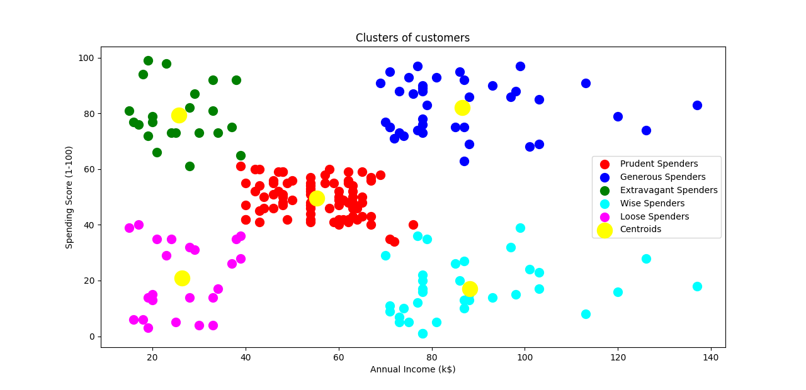

# K-Mean Clustering
K-Mean Clustering with FastAPI and Streamlit App

## Table of Contents
 - [Description](#description)
 - [Requirements](#requirements)
 - [Getting Started](#getting-started)
   - [1. Train and Save the Model](#1-train-and-save-the-model)
   - [2. Deploy FastAPI](#2-deploy-fastapi)
   - [3. Run Streamlit](#3-streamlit)
 - [Usage](#usage)
 - [Endpoints](#engpoints)
 - [Example Input and Output](#example-input-and-output)
 - [File Structure](#file-structure)
 - [License](#license)

## Decription
This project demonstrates clustering data into groups using the K-Means algorithm. It includes an API for clustering and a Streamlit app where users can input data to find the appropriate cluster. The dataset includes the following features:
- Annual Income (k$)
- Spending Score (1-100)

The API is deployed using FastAPI, and a Streamlit app provides an interactive interface for users to input values and get predictions.

# Requirements
To set up and run this this project, you will need the following python packages:

- 'fastapi'
- 'uvicorn'
- 'scikit-learn'
- 'pandas'
- 'joblib'
- 'numpy'
- 'streamlit'

You can install these dependencies by running:

```bash
pip install -r requirements.text
```

## Getting Started
Follow these steps to set up and run the project.

1. Train and Save Model

   Train the K-Mean model using scikit-learn, and save the trained model to a file for deployment
   ```bash
   python k-means_model.py
   ```
   This will create the `model.pkl` file in the `model/` directory.
2. Deploy FastAPI
The FastAPI application (`api.py`) loads the saved model and provides an endpoint for predictions. Run it using uvicorn:
uvicorn api:app --reload

This will start the FastAPI server at `http://127.0.0.1:8000`

3. Run Streamlit
The Streamlit app allows users to input values and retrieve predictions from the FastAPI server. To start Streamlit, run:
  ``` bash
streamlit run app.py
  ```
The Streamlit app will open in a browser window at `http://localhost:8501`

## Usage

FastAPI Endpoints


- POST /predict
   - Description: Returns the predicted cluster (`Prudent Spender`,`Generous Spender`, `Extravagant Spender`, `Wise Spender`, `Loose Spender`) for the input data.
   - Input JSON:
   ```bash
   {
  "annual_income": 18,
  "spending_score": 72
   }
   ```
   - Output JSON:
   ```bash
   {
  "cluster": "Extravagant Spender"
   }
   ```
### Streamlit Application

The Streamlit app provides an interface for users to input feature values and get predictions. When the Predict button is clicked, the app sends the data to the FastAPI server and displays the grouping.

## Example Input and Output
Example Input:

Annual Income = 18
Spending Score = 72

Example Output:

Prediction: `Extravagant Spender`

## File Structure
The project directory is structured as follows:

```
📦 logistic_regression_classifier
├─NBSPdata
│ NBSPNBSP└─ data_clustering.csv
├─NBSPmodel
│ NBSPNBSP└─ NBSPmodel.pkl
├─NBSPsrc
├─NBSP.gitignore
├─NBSPapp.py
├─NBSPapi.py
├─NBSPk_means_model.py
├─NBSPREADME.md
└─NBSPrequirements.txt
```
## License
This project is licensed under [

